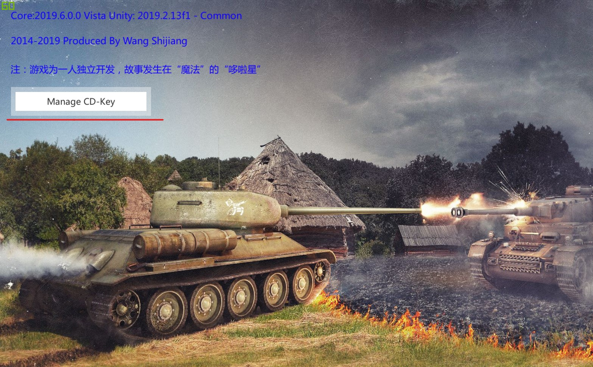
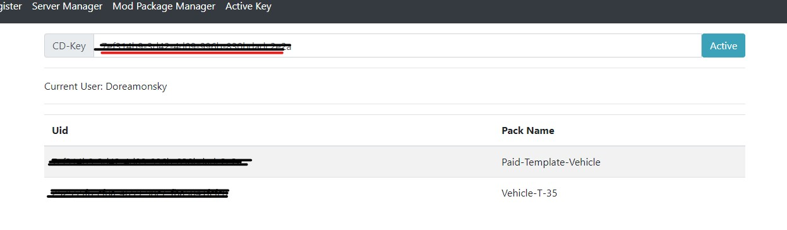

# 如何激活付费模组

## 1. 购买密钥

可联系模组开发者，购买密钥。

## 2. 注册游戏账号

打开游戏，左上角 Register 按钮进行注册账号。注册完毕后，在游戏中登陆账号。

登陆成功后，会显示如下按钮。

## 3. 激活密钥

点击 Manage CD-Key ， 在弹出的页面登陆账号。

在输入框输入密钥，点击 Active 即可激活密钥。

## 4. 安装付费模组

按照普通模组的安装方法，进行安装。然后重新进入游戏，即可看到付费载具/地图等。
