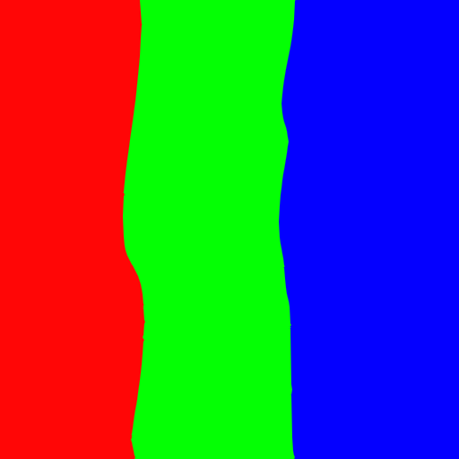
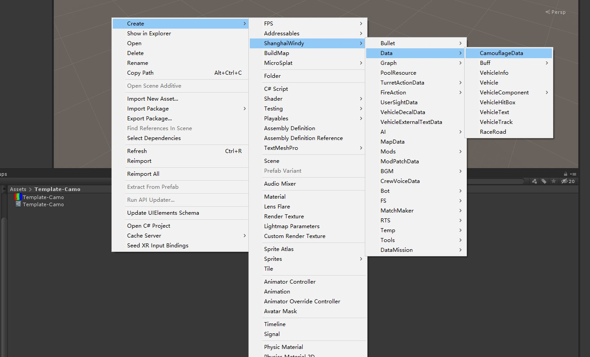
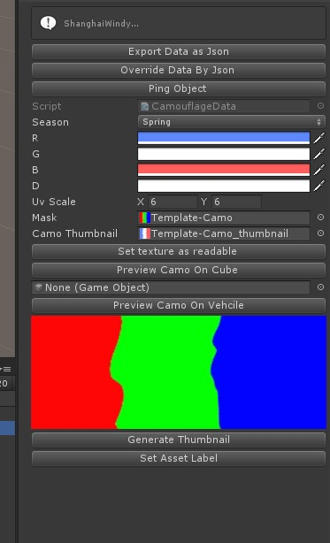

# Camouflage Mod

## Prepare Project

Refer [GetStarted](GetStarted.md) page to download Unity and editor tools.

## Prepare Mask Texture

To create camouflage mod, you will need to prepare a color mask with r,g,b. You can refer the following one.

## Create Camouflage Data

Then, you will need to create camouflage data in the unity.

## Edit Camouflage Data

Drag the color mask texture into "Mask". Then click set texture as readable. 

- You can adjust r,g,b channel colors.
- You can preview texture by clicking preview camo on cube button.

Click generate Thumbnail Button when you finish coloring.
In the end, click Set Asset Label button.

