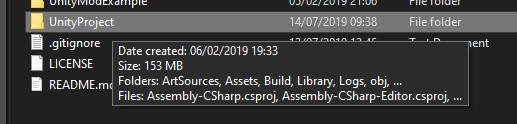
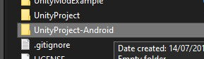
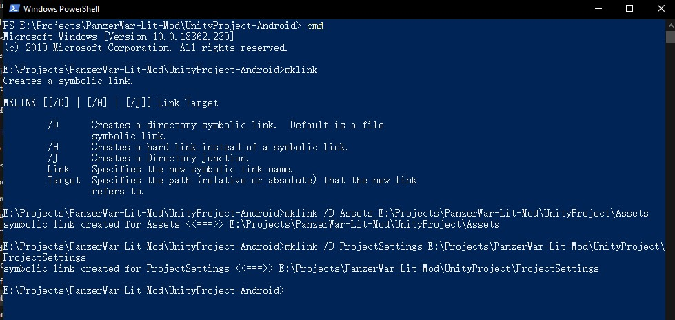
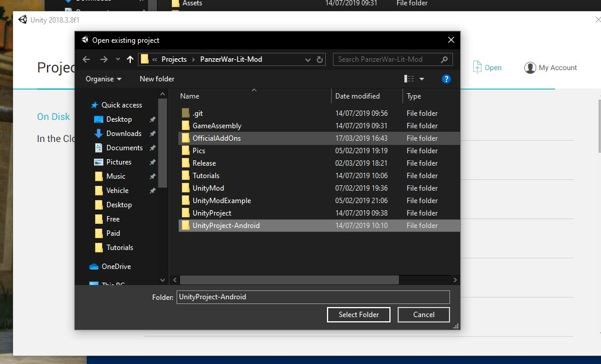
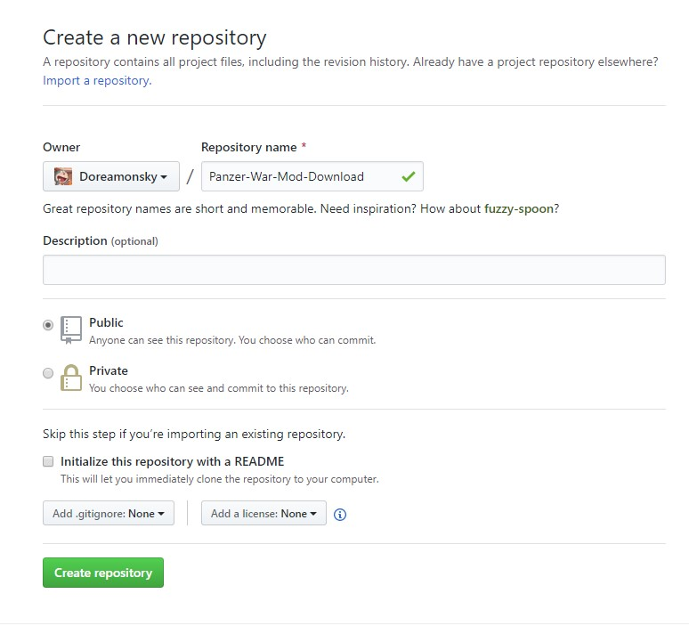
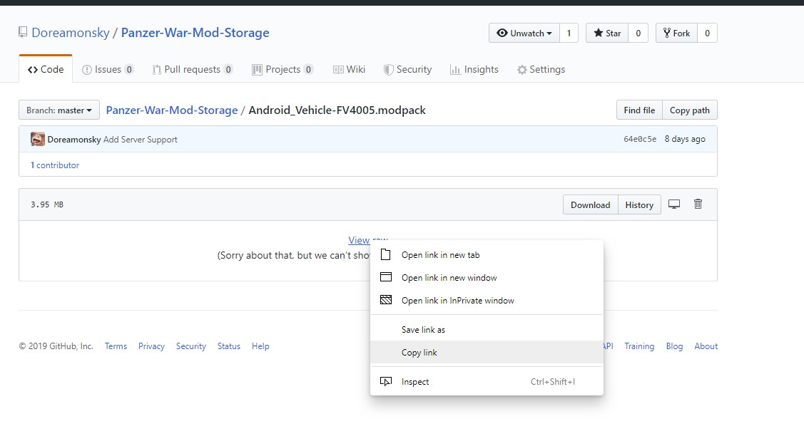

# Share the Mod to community

## Platform Build

Support for both Windows and Android is a must for sharing the Mod to the community.Here is a quick way for you to build two platforms without swtiching the platform.

Suppose you have a Mod project with Windows build platform here. And,you want to build Android platform now.

First,create a folder somewhere else.

Then,open the cmd and cd to that folder.

Make a folder link.

Then,you can open this folder in Unity and the files are the same all the time as what in your Windows project. Then you can switch its platform to Android.

## Upload Mods

You can upload the mods to a new repository on the GitHub. It is free. You can use this tool for uploading. <https://desktop.github.com/>

Copy this link as the download link.

You can make a post here. <https://github.com/Doreamonsky/Panzer-War-Lit-Mod/issues>
