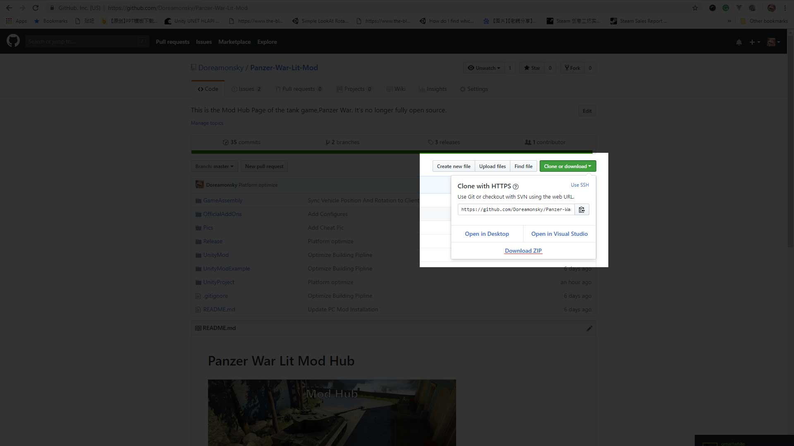
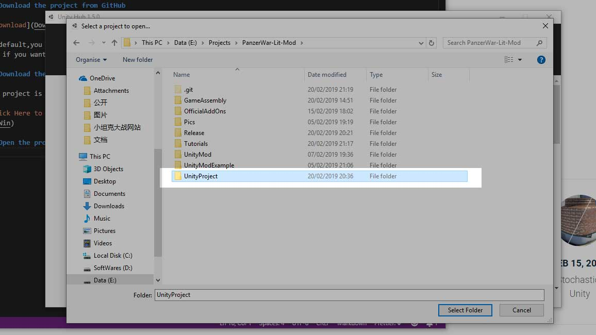
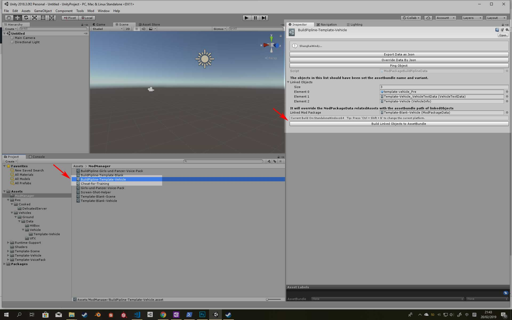
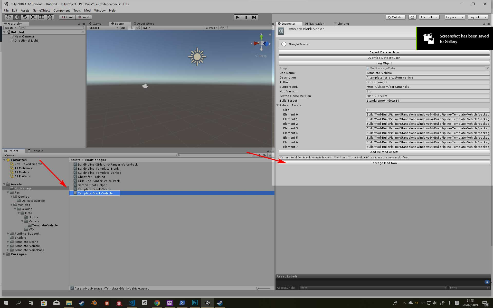

# Get Started

## 1.Download the project from GitHub

By default,you can click the blue download button and download ZIP.Alternatively, you can clone by git if you want to contribute to the source code.

And Unzip what you have downloaded.

## 2.Download the Unity 2019.2.13f1

The project is running based on Unity **2019.2.13f1**. You can download this version from Unity Hub.

## 3.Open the project

Open this folder as the project in the Unity.

## 4.Local Build and test

Press Ctrl + Shift + B to select your desired platform.
**Remember you can't run mods with an incorrect build platform**

In this demonstration,we will build Template-Blank-Vehicle as an example.

First,find the BuildPipline-Template-Vehicle.(Its path is 'Assets/BuildPipline-Template-Vehicle')

Then,Click Build Linked Objects to AssetBundle

During the process,it will build all the objects in the array linked objects to the [Unity AssetBundle](https://docs.unity3d.com/Manual/AssetBundlesIntro.html).And then it will modify the Linked Mod Package.The related assets in the linked mod package will be overrided by the path of built AssetBundles.

Then,click the Template-Blank-Vehicle.It will build all related assets to a modpackage with mod info.The generated path(for Android platform) is "UnityProject\Build\Mod-Package\Android\Template-Blank-Vehicle"

And you can install this modpackage on your local device like the officials mods.

If you run the mod successfully,you should be able to find this template-vehicle at the bottom of the vehicle list in the garage.

## For Futher Mod

Tutorial: [Import a vehicle mod](Vehicle.md)
Tutorial: [Upload the mod package](ContributeCommunity.md)

To be continued.
