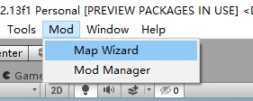
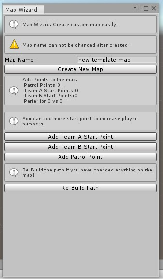
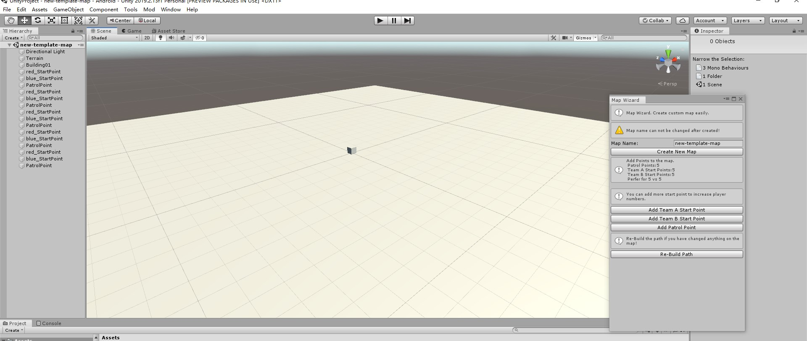
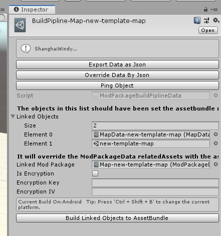
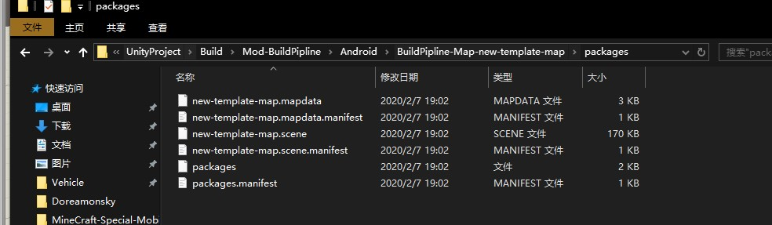
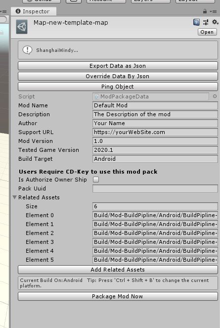
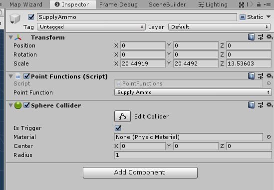

# Map Wizard Tutorial

**If you have any issue during reading this tutorial,you can send an email to me. My E-mail: 403036847@qq.com Or Contact me on [VK](https://vk.com/doreamonsky)**

The Map Wizard Tool is built for creating custom map easily.

## Find the tool

You can open this tool from this menu if you have installed the Panzer War Mod SDK correctly.

## Create the map

Change the map name and click Create New Map. (You can keep the default map name)

Then,the new map is created. It is an almost empty map. You can add buildings and terrains into it. And you have to set the tag of the buildings and terrains. You can refer to the default objects.Also,you can add points to the map. Finally,you should click re-build path if you changed something on the map.

## Build the assets

You can find the BuildPipline file in the folder "ModManager". It names BuildPipline-Map-YourMapName. And click Build Linked Objects to AssetBundle

## Package Files

You can find the ModPackage file in the folder "ModManager". It names Map-YourMapName. Click Package Mod Now. And you can get the .modpack file.

## Extra - Point function

You can add repair and supply point in the map.
