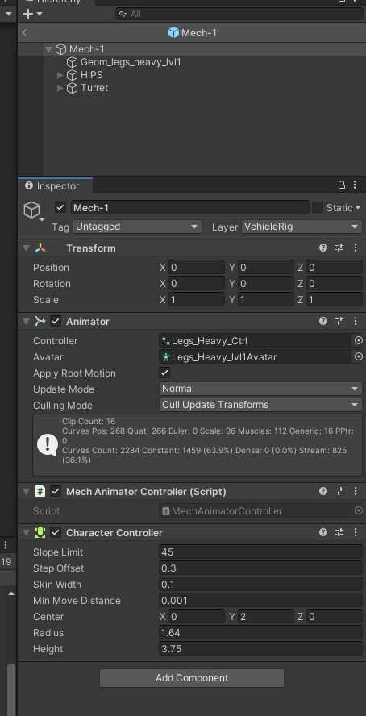

# 创建机甲

**如果你在阅读本教程过程中遇到任何问题，都可以 QQ 联系我 QQ:403036847.**

在阅读此文本之前，请务必有普通坦克模组的开发经验。

## 前期准备

### 1. 模型

骨骼模型：一个绑定骨骼的机甲模型。

伤害模型：一个将各个关节分离的简易的伤害模型。

### 2. 动画

你至少需要拥有以下动画：
1. 待机动画
2. 走路动画：笔直向前走路动画，向左的走路动画，向右的走路动画，原地左转的动画，和原地向右的动画。

注：倒退走路动画可以在动画树中，以-1倍的速度播放，实现倒退。

你可以额外制作以下动画:
1. 飞行动画：飞行起步动画，飞行中待机动画，和飞行结束落地动画。

### 3. 导入引擎动画的设置

动画导入引擎后有相关设置，才可以使机甲符合物理模拟效果。

1. 需要将 Root Transform Position (Y) 中的 Bake Into Pose 勾上。
2. 在 Curve 增加 GravityWeight 属性，**并将曲线设置为值为1的水平线。**
3. 含脚步落地的动画帧，在 Events 中添加 WalkSound 事件。

## 载具属性设置

### 机甲预制体制作

1. 动画控制器。在含有Animator组件的物体上增加 MechAnimatorController 组件 和 CharacterController 组件。

2. 物理碰撞。调整 CharacterController 的属性，使胶囊体底部与脚底一致。

3. 机甲脚底碰撞。在机甲两个脚底均增加 MechLegEndPoint 组件，与BoxCollider 组件。并勾选 BoxCollider 的 isTriiger 属性。若机甲可以飞行，则增加 MechFireBurst 组件,并调整相应参数。

4. 炮塔同步。增加 Turret/Gun/Dym 的空物体。在机甲模型上，上半身旋转控制的位置增加 MechTurretSync 组件，来同步相应位置。

### 动画树制作

在 Project 新增 Animator Controller 并拖入机甲预制体含Animator的组件上。

1. 增加如下参数。 类型一定要与图中一致。

2. 增加动画状态。 若含飞行的三个状态动画，则一定要与图中的三个Jet开头的动画命名一致。

向前走路（Walk）由多个动画的混合组成（Blend Tree）。 混合使用的参数为 Turn。0.5为笔直向前的动画。 0为向左的走路动画，1为向右的走路动画。可以在中间插入更多动画作补帧，使动画更加自然。

注：倒退动画可以在动画树中，以-1倍的速度播放，实现倒退。

3. 动画转换条件。在下图出现的连线，需要增加如图的条件。

向前走路动画条件:

向后走路动画条件:

向左走路动画条件:

向右走路动画条件:

若含飞行动画，则飞行落地动画条件:

从 Idle 转到其他状态，无需设置 Has Exit Time。其他状态转到 Idle ，则需要设置 Has Exit Time。

注意:游戏的输入为 Walk 与 Turn 。Walk 的范围为 -1到1。Turn的范围为 0到1。 可以根据自己的动画，设置更加复杂的动画切换。 动画系统的条件切换可以在引擎内直接进行调试，可访问 Unity 动画教程了解更多详情。

## 创建 VehicleData

像普通坦克一样，创建坦克配置参数。然后删除生成的 VehicleTrack 文件。

其他配置信息和坦克一样进行配置即可。

在 VehicleTextData 需要额外关心，设置机甲专用参数。

