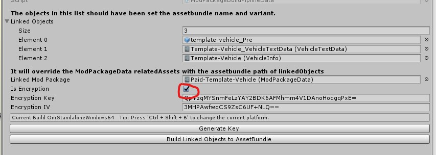
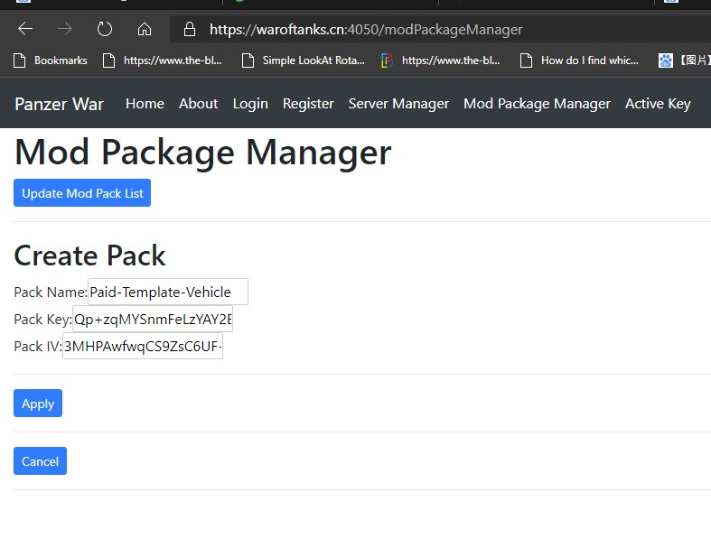
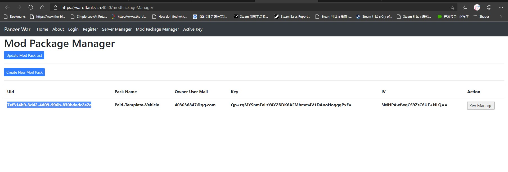
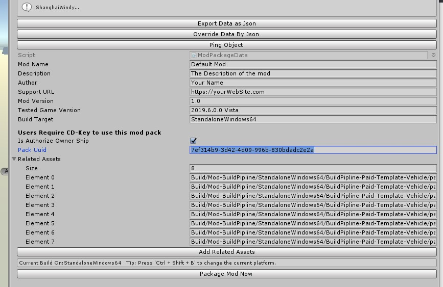
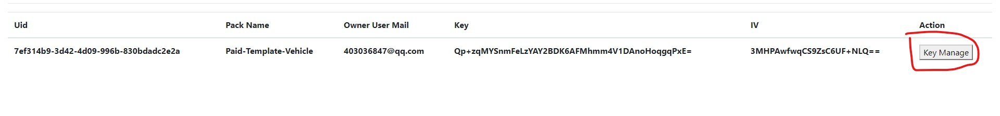
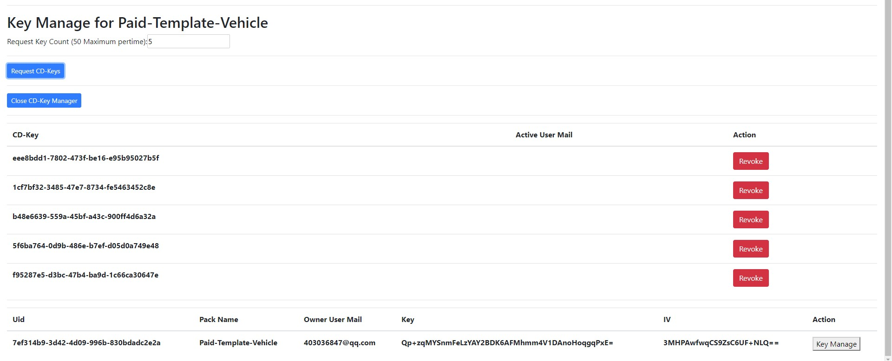
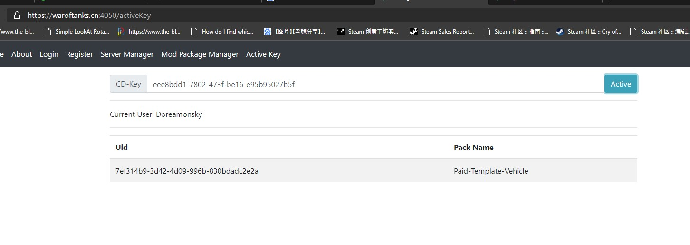

# PaidPackage

Before get started,you need to contact the game developer to get the access to the manage page.
Contact me via email:403036847@qq.com

## Enable Encryption in BuildPipline

The Build-Pipline file will automatically generate key and iv for your package.

## Create Mod Pack

You can manage your paid mod from <https://waroftanks.cn:4050/modPackageManager>.

## Get Uid for ModPackage

## Set Uid for ModPackage

After that,you can build the package as normal.

## Manage CD-Key

## Request CD-Key

## User Active CD-Key

Users can active your keys from <https://waroftanks.cn:4050/activeKey>. They should register an account to use paid mods.
