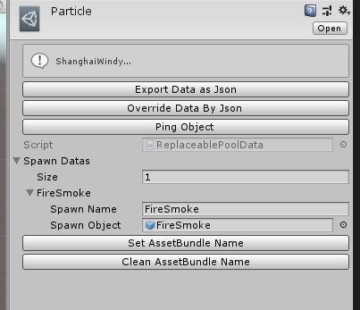
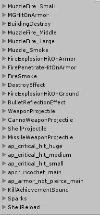

# Replaceable Effect

## Configure SpawnDatas

You can customize the effect of the game by using the **ReplaceablePoolData**.

You can refer spawn name from the following pic.

And,drag your prefab to spawn object.

Then,click 'Set AssetBundle Name' button.

## BuildPipline

After finishing setting the SpawnDatas,add the file to BuildPipline to build it. (You can refer the vehicle document)
