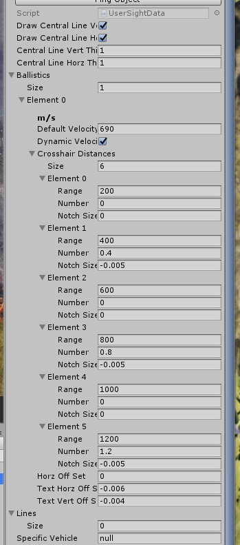

# 瞄准镜自定义

**如果你在阅读本教程过程中遇到任何问题，都可以 QQ 联系我 QQ:403036847.**

打开这里提及的工程 [GetStarted](GetStarted.md).

右键 project 窗口 点击此按钮

您可以参考此设置。
Range 指的是 Notch 表示的下坠距离
Number 指的是 Notch 显示的数字
Notch Size 指的是 Notch 往左突出的距离

如果你要绘制自定义的标线，你可以关闭 drawCentralLineVert 以及 drawCentralLineHorz

注意 Specific Vehicle 请填写 你要自定义瞄准镜的载具名称。

导出点击按钮 'export sightdata for players'.
