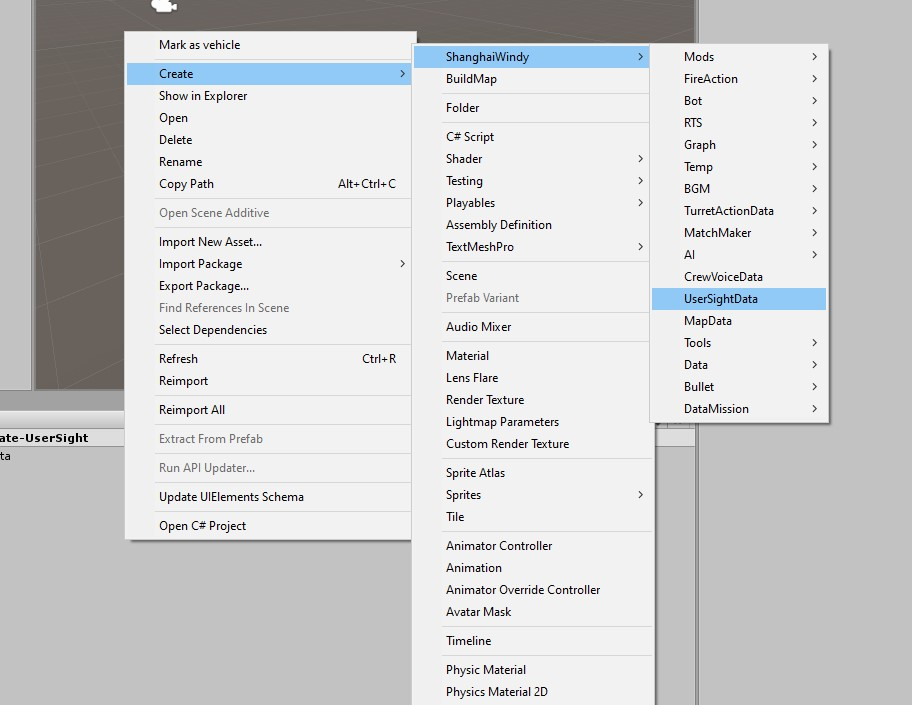
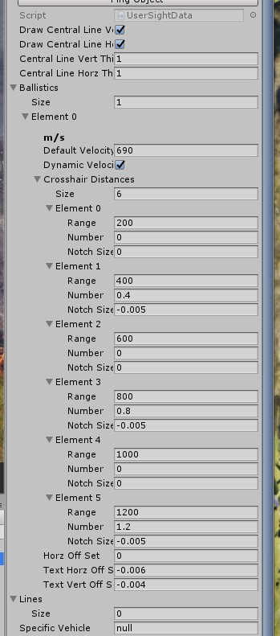
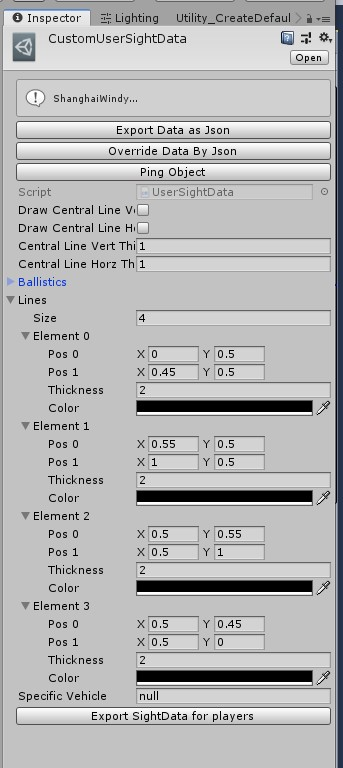

# Sight Mod

**If you have any issue during reading this tutorial,you can send an email to me. My E-mail: 403036847@qq.com Or Contact me on [VK](https://vk.com/doreamonsky)**

Open the project which is mentioned in the [GetStarted](GetStarted.md).

Right click in the project window and click this.

You can refer this setting.
Range is the distance to the target at which the notch will be drawn.
Number is which text will be placed by the notch.
Notch Size is how much to increase the length of the notch from the left.

If you want to draw custom lines,then you can toggle off drawCentralLineVert and drawCentralLineHorz.

For exporting,click the button 'export sightdata for players'.
