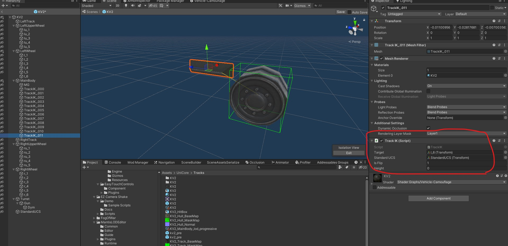

# 悬挂架教程

## 模型准备

1. 从模型上分离悬挂架，并调整为 MainBody 的子物体。朝向通过旋转调整为向前。

2. 在 Unity 3D 载具的碰撞预制中增加一个空物体，并命名为 StandardUCS

3. 在悬挂架模型上添加 TrackIK 组件，并且设置相应的属性。 Target，朝向的负重轮。 Standard UCS，第二步创建的空物体。  注意！所有的悬挂架模型均要设置！

