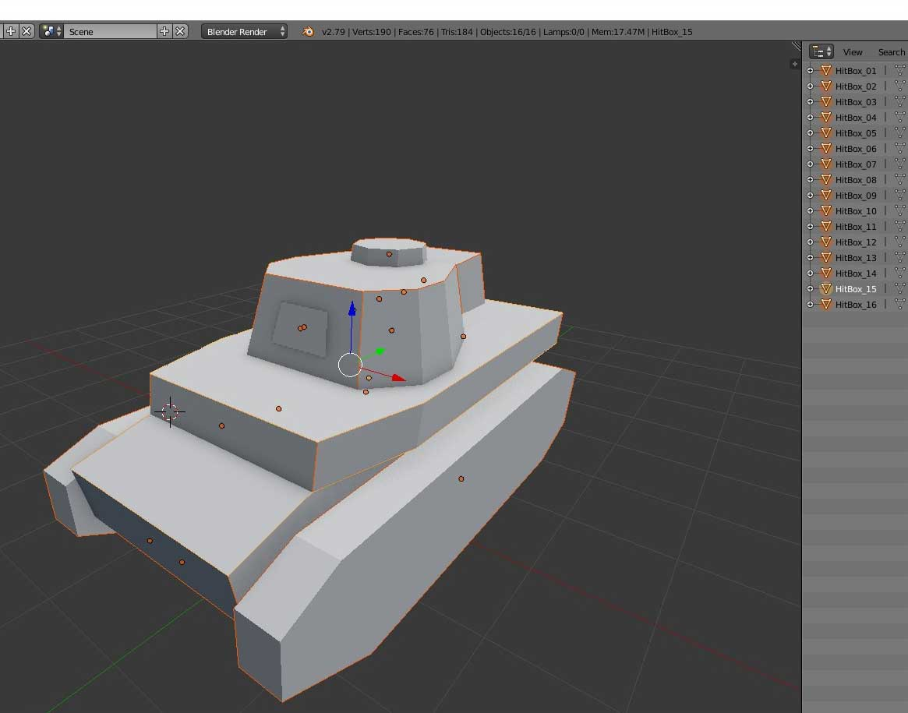
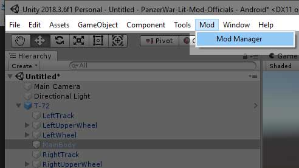
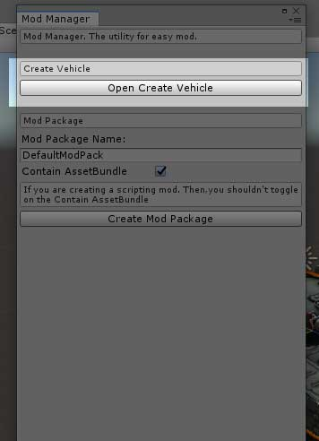
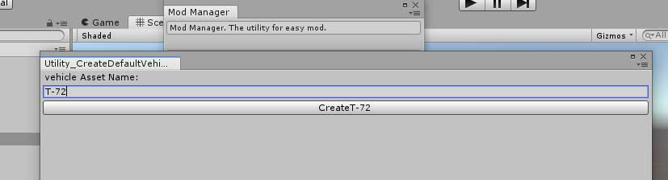
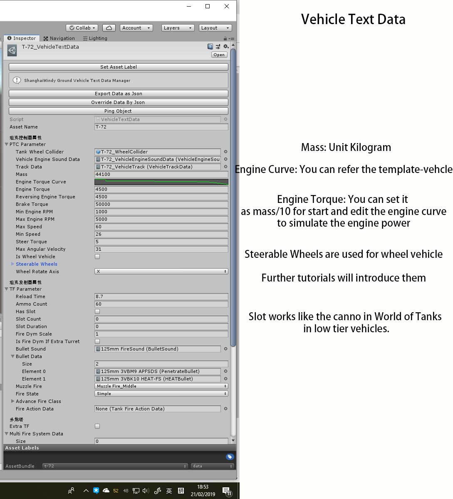
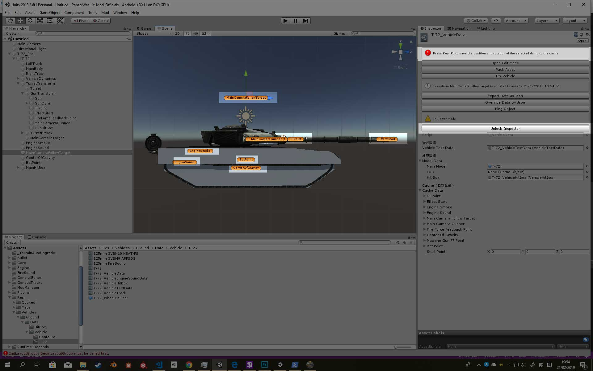
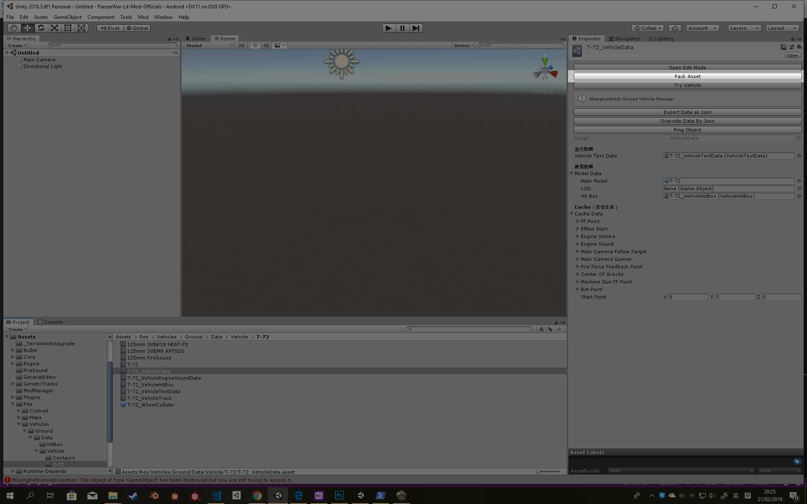
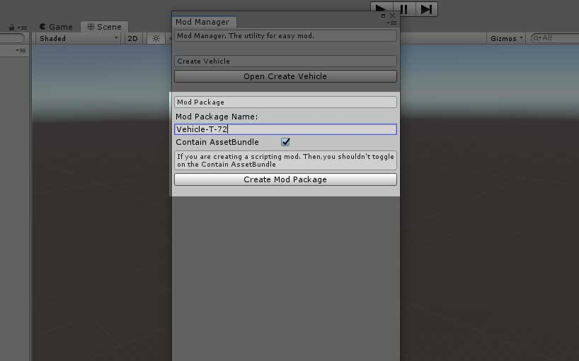

# 车辆模组制作指南

如果你在阅读本教程过程中遇到任何问题，都可以 QQ 联系我 QQ:403036847
注:请以英文文档为准,中文文档仅供参考 [点击查看英文文档](Vehicle.md)
可参考载具模组制作指南视频 <https://www.bilibili.com/video/av58879192/>

## 我需要准备什么

美术素材:

-含有贴图的载具模型与伤害模型

-载具的引擎声音（启动，空转，运动）

-开火音效(近处与远处)

同时完成此教程中的 1-4 节 [开始模组制作指南](GetStarted.md)

## 步骤.1 处理载具模型

坦克的负重轮，炮塔，火炮，炮筒都应该有正确的父子关系与命名

父子关系与命名应该像这个. [点击查看示例文件](https://github.com/Doreamonsky/Panzer-War-Lit-Mod/blob/master/UnityProject/ArtSources/Template-Vehicle.fbx?raw=true)

同时，这里准备了个体面的坦克模型用于你制作的操练.[T110E5 游戏模型](Sources/T1110E5.unitypackage) 你可以通过此模型了解如何制作载具模组

请务必保证以下为规范正确的父子关系与命名！否则，模组工具会报错！

|                 |           |     |
| --------------- | --------- | --- |
| MainBody        |           |     |
| LeftWheel       | l_1-l_n   |     |
| LeftUpperWheel  | l_1-l_n   |     |
| LeftTrack       |           |     |
| RightWheel      | r_1-r_n   |     |
| RightUpperWheel | ru_1-ru_n |     |
| RightTrack      |           |     |
| Turret          | Gun       | Dym |

## 步骤.2 制作坦克伤害模型

伤害模型用于击穿系统。在建模软件中，你应该将不同数值的装甲，分成不同的物体。

[点击查看示例文件](https://github.com/Doreamonsky/Panzer-War-Lit-Mod/blob/master/UnityProject/ArtSources/Template-Vehicle_HitBox.fbx?raw=true)

## 步骤.3 导入载具模型到 Unity 引擎当中

**在开始操作之前，请确保你会 Unity 引擎的基本操作.**

用 Unity 打开在此页面中所提到的项目 [开始模组制作指南](GetStarted.md).

在 Project 窗口创建一个文件夹，并且将你准备的模组素材拖拽进去

建立材质 Material

将载具模型拖拽入场景，开始设置碰撞模型

将 box colldiers 加给 MainBody 以及 Turret. 修改 box collider 的大小以适应 MainBody 和 Turret.

接着，在文件夹中创建一个子文件夹，命名为 Collision. 将你场景中的模型拖拽进。

你可以参考 Template-Vehicle 文件夹.

## 步骤.4 创建坦克数据

在顶部菜单栏找到 Mod/Mod Manager (如果 Console 中有任何错误你应该安装 Unity 2018.3.X 版本)

点击 Open Create Vehicle.

输入你载具的名称，并点击按钮

然后以上文件就会被创建

接着的步骤中，我将展示如何设置他们

### 1. VehicleEngineSoundData

导入你的载具引擎音频素材文件，并且给他们赋值

### 2. VehicleHitBox

Assign the variable External Armor Model with your HitBox model.

点击 Generate Prefab 按钮. 然后,点击 Open Edit Mode.

点击 Generate HitBox Model. 你的伤害模型就会在场景中生成. 点击他们就可以设置装甲厚度与类型.

设置完毕装甲数值后，将他们拖拽进 Prefab 中(如图片中一样)

**最后点击 Save 按钮!!!!!!!**

### 3. VehicleTextData

首先设置开火音效与炮弹属性的资源

右击 Project 窗口，你可以创建火音效与炮弹属性的资源

### FireSound Asset

设置 Fire Near and Fire Far.

如果你没准备开火音效，可以使用内置资源

### Bullet Data Asset

Bullet VFX 请务必使用内置资源
对于 ATGM 请勾上 Missle

===

坦克属性的设置，就交给你来了。可参考示例文件。

### 4. WheelCollider

将 WheelCollider 和 载具模型拖入场景，然后设置 WheelCollider 的属性，并如图进行保存

### 5. VehicleData

用 **在步骤.3 中设置过碰撞模型的载具** 设置 MainModel 然后 点击 Open Edit Mode.

旋转移动 **有橙色图标的** GameObject 到他们正确的位置. 然后,**点击 'K' 按键保存此 GameObject 的位置信息.**

然后,点击 UnLock Inspector.

### 6. VehicleTrack

设置 Track Mesh. (如果你没履带素材，你可使用预制体 Panzer_Track_Middle )

你可以设置 Track Distance(也可以保持默认数值)

其他数值由编辑器生成，不用碰他们

将由 VehicleData 生成的模型拖拽到 Target Edit Object 中

然后 点击 Load Suspension Data 按钮.

(如果你已经删除了 VehicleData 生成的模型的模型. 你可以回到 VehicleData. 然后 点击 Open Edit Mode 再点击 UnLock Inspector)

为了你操作方便，可以在这里隐藏伤害模型

然后,点击 Create Node. 如图，用顶点包围履带.

完成此步骤后，你可以点击 Preview Track 来预览履带 （可移除静态履带获得更好的观察）

**编辑完毕履带后点击 Unlock Inspector.**

### 7. 编译 VehcileData 到预制体

找到 VehicleData r 然后点击 Pack Asset. 他会创建两个物体 位于 Assets/Res/Cooked/xxxx_Pre and Assets/Res/Cooked/DedicatedServer/xxxx_Pre

第一个是客户端文件，第二个是服务器端文件. **如果你修改了碰撞模型，伤害模型或者橙色物体的位置，都需要重进行此步骤**

### 8. 创建 Vehicle Info

创建 Vehicle Info 资源 并重命名为你载具的名称.

设置 vehicle info 然后 点击 Set AssetBundle Name 按钮

## Step.5 创建 Mod Package

再次打开 Mod Manager .

命名 package. **你不能以载具名称来命名！！！会加载错误！！！.** 你应该用以下方式来命名 Vehicle-XXXX (其中 XXXX 是你的坦克名称).

然后点击 Create Mod Package 按钮.

### BuildPipline

将 vehicle info 和 vehicle text data 加入到 linked object. 再加入位于 Assets/Res/Cooked/ 下的 xxxx_Pre 和位于 Assets/Res/Cooked/DelicatedServer 加入到 linked object 中.

点击 Ctrl + Shift + B 切换你要的平台.
**模组必须使用相同的平台才能运行**

然后点击 Build Linked Objects to AssetBundle 按钮.

然后点击 Linked Mod Package.编辑信息然后点击 Package Now.

你的模组文件会生成在 UnityProject\Build\Mod-Package. 扩展名为 modpackage. 可用与之前官方模组与社区模组一样的方式进行安装.

================================

**如果你切换平台需要重开始 BuildPipline 的步骤.**

如果你在阅读本教程过程中遇到任何问题，都可以 QQ 联系我 QQ:403036847

## 特别载具指南

### 轮式载具

模型如上图准备 LeftTrack 和 RightTrack 可以是空物体，但不可缺少

轮式载具设置可以参考上图

### 机炮

参考上图设置

### 弹夹炮

参考上图设置

## 常见问题

### 载具不加载

原因可能如下：Mod Package 的名字应该与载具的名称不同。尝试更换 Mod Package 的名称。 **你不能以载具名称来命名！！！会加载错误！！！.** 你应该用以下方式来命名 Vehicle-XXXX (其中 XXXX 是你的坦克名称).

### 载具加载不正确

原因可能如下：载具含有空引用数据 请检查 VehicleEngineSoundData,VehicleHitBox,FireSound Asset,Bullet Data Asset,VehicleTextData,VehicleTrack and VehicleData.你可以参考案例载具

### 炮管无俯仰角

原因可能如下： down max angle 应该填正数
