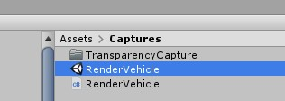
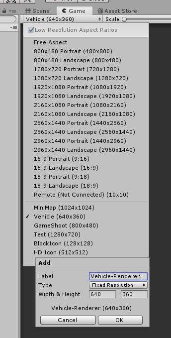
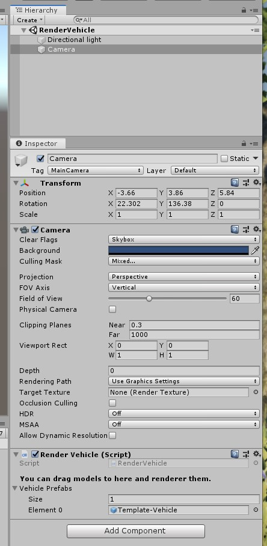
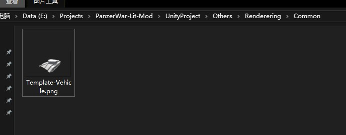
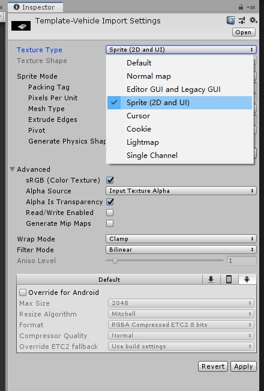
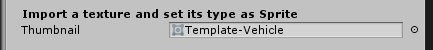

# Thumbnail

Open the scene from here.

Add a new resolution for rendering.

Drag models.

The thumbnail file will be generated at this path.

Import it into the unity and change the texture type.

Assign it to the vehicle info.

