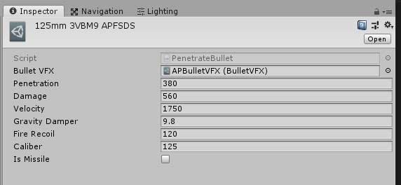
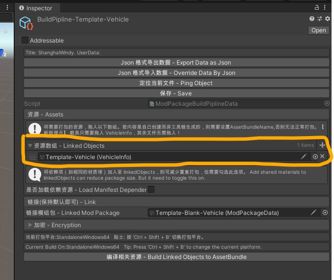

# Vehicle Mod

**If you have any issue during reading this tutorial,you can send an email to me. My E-mail: 403036847@qq.com Or Contact me on [VK](https://vk.com/doreamonsky)**

## What do I need to prepare

Assets:

-Vehicle Model with textures and Vehicle HitBox

-Vehicle Engine Sounds(Start,Idle,Running)

-Fire Sound(Near and Far)

And,finish the Step 1-4 in [GetStarted](GetStarted.md)

## Step.1 Process the Vehicle Model

The wheels,turret,gun and dym(barrel) of the vehicle model should have a correct child-parent relationship and name.

The child-parent relationship should like this. [Click to view the example vehicle model](https://github.com/Doreamonsky/Panzer-War-Lit-Mod/blob/master/UnityProject/ArtSources/Template-Vehicle.fbx?raw=true)

Also,a well prepared game model with hitbox model is available here.[T110E5 Game Model](Sources/T1110E5.unitypackage) You can try start creating the vehicle mod with this model first to understand all the work flow.

|                 |           |     |
| --------------- | --------- | --- |
| MainBody        |           |     |
| LeftWheel       | l_1-l_n   |     |
| LeftUpperWheel  | l_1-l_n   |     |
| LeftTrack       |           |     |
| RightWheel      | r_1-r_n   |     |
| RightUpperWheel | ru_1-ru_n |     |
| RightTrack      |           |     |
| Turret          | Gun       | Dym |

## Step.2 Make the Vehicle HitBox Model

The HitBox Model is used for penetration system. You should separate HitBox to pieces. Every piece of HitBox will have their own armor thickness after being imported to the game engine.

[Click to view the example vehicle HitBox](https://github.com/Doreamonsky/Panzer-War-Lit-Mod/blob/master/UnityProject/ArtSources/Template-Vehicle_HitBox.fbx?raw=true)

## Step.3 Import Vehicle Model to the Unity Engine

**Before getting started,you should have a quick view of the basic control of the Unity Engine.**

Open the project which is mentioned in the [GetStarted](GetStarted.md).

Create a folder in the project window in the Unity Engine,and drag your models into that folder.

Set up the materials.

And then drag the vehicle model from the project window to the Hierachy window to set up the collision.

Add box colldiers to the MainBody and Turret. Modify the size of box collider to suit the the MainBody and Turret.

Then,create a subfolder in your folder and name it Collision.Drag your model from the Hierachy Windows into that folder.

You can refer the Template-Vehicle folder.

## Step.4 Create Vehicle Data

You should find Mod/Mod Manager in the top windows bar ,if there are no errors in the console.(If there are errors,you should install Unity 2018.3.0 f2)

Click Open Create Vehicle.

And input the name of your vehicle. Then,click the button.

These files will be created.

In the following,I will guide you how to set them one by one.

### 1. VehicleEngineSoundData

Drag your sound files to the project window. And assign the variables one by one.

### 2. VehicleHitBox

Assign the variable External Armor Model with your HitBox model.

Click Generate Prefab Button. Then,Click Open Edit Mode.

Click Generate HitBox Model. You will notice that HitBox Model are generated in the scene. And you can set the armor thickness by clicking it.

After you set all the armor thickness. Drag them into the blue prefab like the picture.

**Finally,Click Save Button!!!!!!!**

### 3. VehicleTextData

Before that,we need to create fire sound assets and bullet data assets.

By right clicking the project window,you can create fire sound asset and bullet data asset.

### FireSound Asset

Set the variable of Fire Near and Fire Far with fire sound.

You can use in-built sounds if you don't prepare it.

### Bullet Data Asset

Be sure to use in-built Bullet VFX!
And for ATGM,be sure to toggle Is Missle on.

===

Set the vehicle data as you wish or according to the histroy.

### 4. WheelCollider

Drag the WheelCollider and the main model into the scene so that you can edit the wheel collider data much more easier.After you set them,right click the variable with blue rect and click apply to prefab XXXX.

### 5. VehicleData

Assign the variable MainModel with **The one you have dragged to the collision folder in Step.3** and click Open Edit Mode.

Move and rotate the GameObject with **orange icon** to the right position and rotation. Then,**press 'K' key to save the transform data of the selected GameObject to the vehicle data.**

Then,Click UnLock Inspector.

### 6. VehicleTrack

Assign the variable Track Mesh. (You can use Panzer_Track_Middle prefab if you don't prepare the single track model)

And edit the Track Distance(You can leave it for default value now)

Other data are generated by editor itself. So don't touch it unless you know what you are doing.

Drag the GameObject generated by VehicleData to Target Edit Object.

Then Click the Load Suspension Data Button.

(If you have deleted that GameObject. You can regenerate it by going back to VehicleData. Then Click Open Edit Mode and click UnLock Inspector)

For your convenience,you can hide the HitBox from here.

Then,Click Create Node. Surround the track with your nodes.

When you have done it,you can click Preview Track. You can remove the static track to view the advacne track more clearly.

**Click Unlock Inspector when you have finished editing the track.**

### 7. Build VehcileData to Prefab

Find VehicleData and click Pack Asset. It will generate two prefab located at Assets/Res/Cooked/xxxx_Pre and Assets/Res/Cooked/DedicatedServer/xxxx_Pre

For the client,only the first one is useful. **You will need to do this build task again if you have changed the hitbox or edit the node transform with orange icon.**

### 8. Create Vehicle Info

Create Vehicle Info asset and rename it to your vehicle name.

Set the vehicle info and click the Set AssetBundle Name Button

## Step.5 Create Mod Package

Open Mod Manager again.

Name a package. **You can't just name it as your vehicle name.** You should name it in the following pattern Vehicle-XXXXXX.

And click Create Mod Package Button.

### BuildPipline

Drag your vehicle info and vehicle text data to the linked object. And drag xxxx_Pre located at Assets/Res/Cooked/ and xxxx_Pre located at Assets/Res/Cooked/DelicatedServer to the linked object.**(This asset will be missing everytime you click Pact Asset in VehicleData in some Unity version)**

Press Ctrl + Shift + B to select your desired platform.
**Remember you can't run mods with an incorrect build platform**

And then,click the Build Linked Objects to AssetBundle button.

Then click the Linked Mod Package.Edit the infos and click Package Now.

You modpackage will be generated at UnityProject\Build\Mod-Package. And its extension is modpackage.You can test it with the common installation.

================================

**If you switch the platform. You should go to the BuildPipline and click the Build Linked Objects to AssetBundle button. Then go to the Linked Mod Package and click Package Now.**

If you have any issue during reading this tutorial,you can send an email to me. My E-mail: 403036847@qq.com Or Contact me on [VK](https://vk.com/doreamonsky)

## Issues You may encounter

### Game can't load the vehicle

In this case,the reason might be that the name of your mod package is the same as the vehicle name. This is not allowed. Try another mod package name. For example,the mod package name can be Vehicle-XXXX (XXXX refer to the vehicle name) eg. Vehicle-T-72

### Game can't load the vehicle correctly

In this case,the reason might be that your vehicle assets miss some reference. Please check if the following files are set correctly VehicleEngineSoundData,VehicleHitBox,FireSound Asset,Bullet Data Asset,VehicleTextData,VehicleTrack and VehicleData. You can refer to this document and you can refer to the template vehicle in the project.

### Can't elevate the gun

In this case,the reason might be that down max angle can't be negative. It should be positive.
